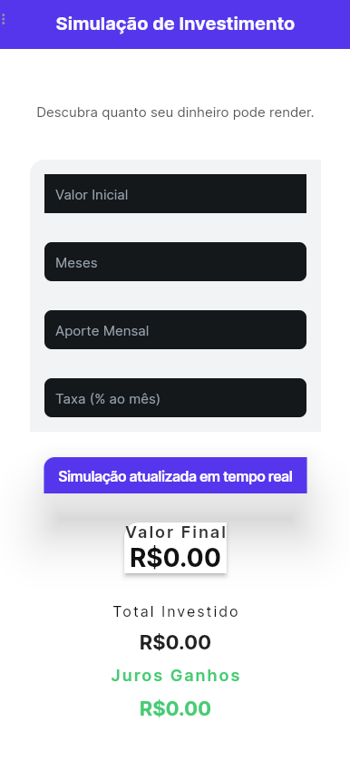
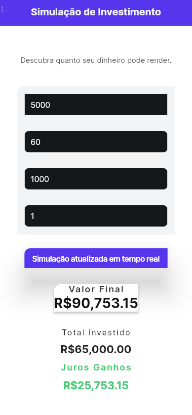

# 📈 Investment Simulator App

A compound interest investment simulator built with FlutterFlow.

This project was created to combine financial logic, product thinking, and technical implementation into a real, functional mobile application.

---

## 🎯 Purpose

The goal of this project is simple:
To build a practical financial tool that helps users understand how recurring investments grow over time through compound interest.
It focuses on:
Financial clarity
Logical modeling
Clean UX
Real-world usability

---

## 🧮 Financial Model

The app uses the compound interest formula with:
Initial capital
Recurring monthly contributions
Monthly interest rate
Time (in months)

Formula:
FV = P₀(1 + i)^n + A × ((1 + i)^n − 1) / i

Where:

P₀ = initial investment
A = monthly contribution
i = monthly interest rate
n = number of months
FV = final accumulated value

The results are dynamically calculated and formatted in real time.
---

## 📸 Screenshots

| Initial Simulation | Result Example |
|--------------------|----------------|
|  |  |
---

## 🚀 Current Features

Manual input of:
Initial value
Investment duration
Monthly contribution
Monthly interest rate
Real-time compound interest calculation
Clear breakdown of:
Final value
Total invested
Interest earned
Currency formatting
Structured state management

---

## 🧠 What This Project Demonstrates

This project demonstrates:
Logical structuring of financial calculations
State handling inside a low-code environment
Product-oriented thinking
UX refinement through iteration
Problem solving through testing and validation
It is part of an ongoing journey to deepen technical skills while building real, usable products.
---
## 🛠 Tech Stack

FlutterFlow
Dart logic (Custom Functions)
Page State management
Financial calculation modeling

---

## 🗺 Roadmap

- [x] Compound interest calculation with monthly deposits
- [x] Real-time UI updates
- [x] Result breakdown
- [ ] Data persistence
- [ ] Growth chart visualization
- [ ] Play Store release

---

## 📌 Project Status

Actively evolving.

Focused on continuous improvement, UX refinement, and technical expansion.

---

## 👨‍💻 About the Author

Built as a side project focused on:
Financial education
Logical modeling
Product development
Continuous technical growth
